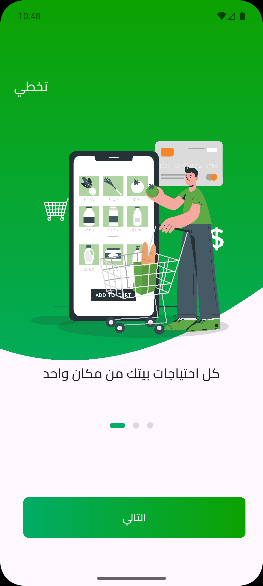
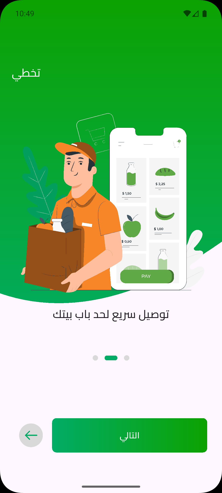
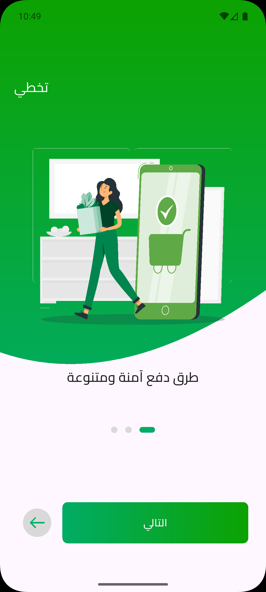
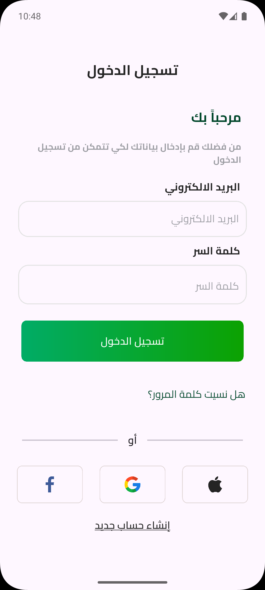
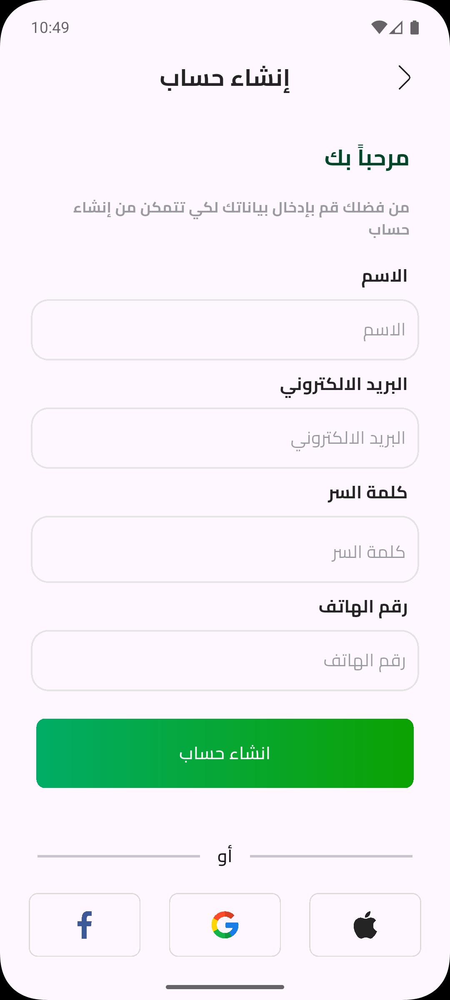
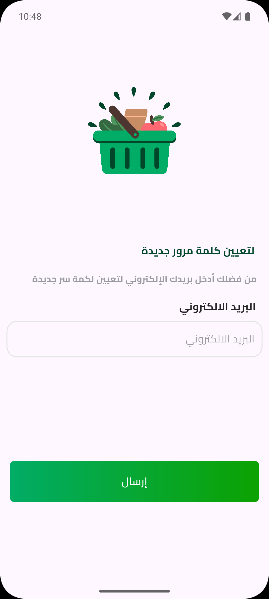
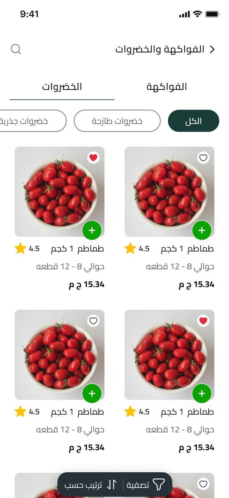
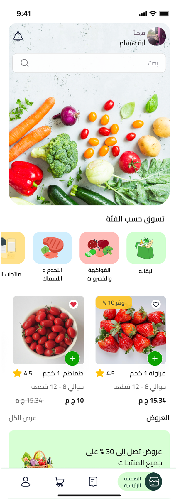

<div align="center">

# 🛍️ Alamashi App

### تطبيق تسوق إلكتروني متكامل

[](https://flutter.dev)
[](https://dart.dev)
[](https://firebase.google.com)

<p align="center">
  <strong>تطبيق تسوق إلكتروني عصري مبني باستخدام Flutter، يوفر تجربة مستخدم سلسة مع دعم كامل للغة العربية</strong>
</p>

[المميزات](#-المميزات-والخصائص) • [التقنيات](#️-التقنيات-المستخدمة) • [التثبيت](#-التثبيت-والتشغيل) • [التصميم](#-التصميم)

</div>

---

## 📱 لقطات من التطبيق

<div align="center">

### شاشات الترحيب (Onboarding)

<p>
  
  
  
</p>

### شاشات المصادقة (Authentication)

<p>
  
  
  
</p>

### الشاشات الرئيسية

<p>
  
  
  
  
</p>

</div>

---

<div dir="rtl">

## ✨ المميزات والخصائص

### 🔐 المصادقة والأمان
- **نظام تسجيل دخول متعدد**: دعم تسجيل الدخول عبر البريد الإلكتروني وكلمة المرور
- **تسجيل دخول اجتماعي**: ربط سريع عبر Google، Facebook، وApple ID
- **استعادة كلمة المرور**: نظام آمن لإعادة تعيين كلمة المرور
- **مصادقة عبر Firebase**: حماية متقدمة لبيانات المستخدمين

### 🛒 تجربة التسوق
- **تصفح المنتجات**: عرض شامل للمنتجات مع صور عالية الجودة وتفاصيل كاملة
- **عربة تسوق ذكية**: إضافة، تعديل، وحذف المنتجات بسهولة
- **البحث والفلترة**: إيجاد المنتجات المطلوبة بسرعة
- **المفضلة**: حفظ المنتجات المفضلة للعودة إليها لاحقاً

### 🎨 التصميم وتجربة المستخدم
- **تصميم عصري ومتجاوب**: واجهة حديثة تتناسب مع جميع أحجام الشاشات
- **دعم كامل للغة العربية (RTL)**: تجربة محلية مثالية للمستخدمين العرب
- **رسوم متحركة سلسة**: انتقالات وحركات تفاعلية محسّنة
- **وضع الليل/النهار**: خيارات مرنة للعرض

### 🔔 التواصل والإشعارات
- **إشعارات فورية**: تنبيهات للعروض والتحديثات المهمة
- **تتبع الطلبات**: معرفة حالة الطلبات بشكل لحظي

## 🛠️ التقنيات المستخدمة

### البنية التحتية والمعمارية

| التقنية | الاستخدام |
|---------|-----------|
| **Flutter** | إطار العمل الرئيسي لبناء التطبيق |
| **Dart** | لغة البرمجة |
| **MVVM** | النمط المعماري للتطبيق |
| **BLoC / Cubit** | إدارة الحالة (State Management) |

### المكتبات والأدوات الأساسية

```yaml
dependencies:
  # الشبكات والاتصال
  dio: # للتعامل مع RESTful APIs

  # إدارة الحالة
  flutter_bloc: # إدارة حالة التطبيق

  # المصادقة والأمان
  firebase_auth: # نظام المصادقة
  google_sign_in: # تسجيل دخول Google

  # التخزين المحلي
  shared_preferences: # حفظ البيانات محلياً

  # الواجهة والتصميم
  cached_network_image: # تحميل وحفظ الصور
  shimmer: # تأثيرات التحميل
```

### الخدمات الخارجية
- **Firebase Authentication**: المصادقة وإدارة المستخدمين
- **Firebase Cloud Messaging**: الإشعارات الفورية
- **RESTful API**: التواصل مع الخادم الخلفي

## 🎨 التصميم

تم تصميم واجهة المستخدم بالكامل على Figma باستخدام أحدث معايير UI/UX

<div align="center">

[](https://www.figma.com/design/mMKG7xwkavpY2ePmKVnjc7/%D8%B9%D8%A7%D9%84%D9%85%D8%A7%D8%B4%D9%8A?node-id=661-1498&t=TZgv5a6Huw28lTMc-0)

**[🔗 اضغط هنا لمشاهدة التصميم الكامل](https://www.figma.com/design/mMKG7xwkavpY2ePmKVnjc7/%D8%B9%D8%A7%D9%84%D9%85%D8%A7%D8%B4%D9%8A?node-id=661-1498&t=TZgv5a6Huw28lTMc-0)**

</div>

## 📦 التثبيت والتشغيل

### المتطلبات الأساسية

قبل البدء، تأكد من تثبيت:
- Flutter SDK (الإصدار 3.0 أو أحدث)
- Dart SDK
- Android Studio / Xcode
- حساب Firebase مع مشروع مُعد

### خطوات التثبيت

1. **استنساخ المشروع**
```bash
git clone https://github.com/your-username/alamashi-app.git
cd alamashi-app
```

2. **تثبيت الحزم**
```bash
flutter pub get
```

3. **إعداد Firebase**
   - أنشئ مشروعاً جديداً على [Firebase Console](https://console.firebase.google.com)
   - أضف تطبيقات Android و iOS
   - حمّل ملفات الإعداد:
     - `google-services.json` للأندرويد في `android/app/`
     - `GoogleService-Info.plist` للـ iOS في `ios/Runner/`

4. **تشغيل التطبيق**
```bash
flutter run
```

### بناء النسخة النهائية

**للأندرويد:**
```bash
flutter build apk --release
```

**للـ iOS:**
```bash
flutter build ios --release
```

## 📁 هيكلية المشروع

```
lib/
├── core/                 # الملفات الأساسية المشتركة
│   ├── constants/       # الثوابت والقيم الثابتة
│   ├── utils/          # الدوال المساعدة
│   └── themes/         # الألوان والأنماط
├── data/                # طبقة البيانات
│   ├── models/         # نماذج البيانات
│   ├── repositories/   # مستودعات البيانات
│   └── services/       # الخدمات (API, Local Storage)
├── logic/               # منطق الأعمال (BLoC/Cubit)
│   ├── auth/
│   ├── products/
│   └── cart/
└── presentation/        # طبقة العرض
    ├── screens/        # الشاشات
    ├── widgets/        # المكونات القابلة لإعادة الاستخدام
    └── routes/         # التوجيه والملاحة
```

## 🤝 المساهمة

نرحب بمساهماتكم! إذا كنت تريد المساهمة في تطوير المشروع:

1. Fork المشروع
2. أنشئ فرعاً جديداً (`git checkout -b feature/AmazingFeature`)
3. قم بعمل Commit لتغييراتك (`git commit -m 'إضافة ميزة رائعة'`)
4. ادفع إلى الفرع (`git push origin feature/AmazingFeature`)
5. افتح Pull Request

## 📄 الترخيص

هذا المشروع مرخص تحت [MIT License](LICENSE)

## 📞 التواصل

إذا كان لديك أي استفسارات أو اقتراحات:

- **البريد الإلكتروني**: ahmedabdelkrim125@gmail.com
- **LinkedIn**: [Ahmed Abdelkrim](https://www.linkedin.com/in/ahmed-abdelkrim166)
- **Facebook**: [Ahmed Abdelkrim](https://facebook.com/ahmedabdelkrim)

---

<div align="center">

**صُنع بـ ❤️ في مصر**

إذا أعجبك المشروع، لا تنسَ إضافة ⭐

</div>

</div>
